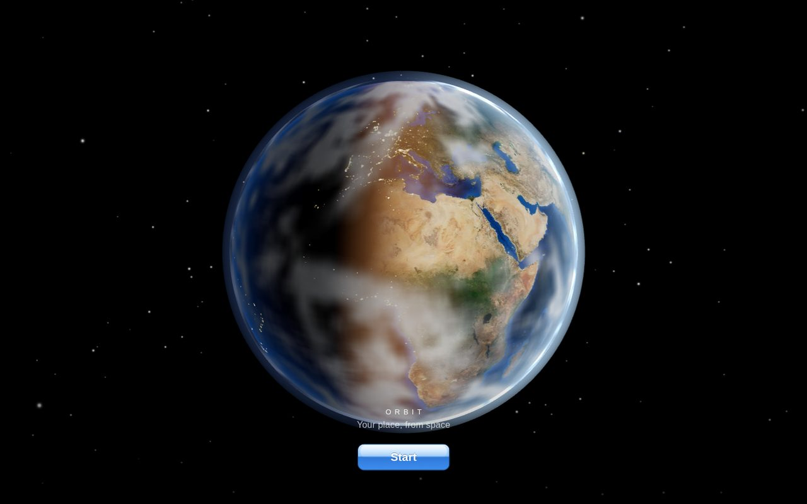
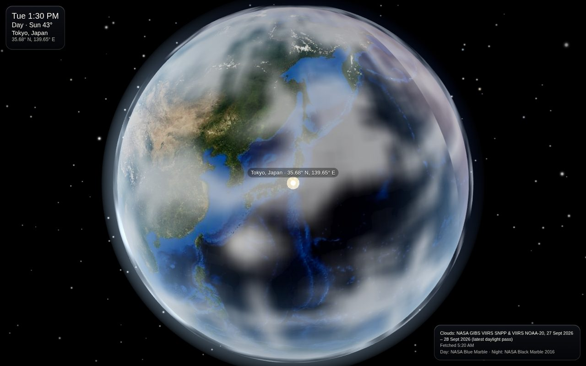
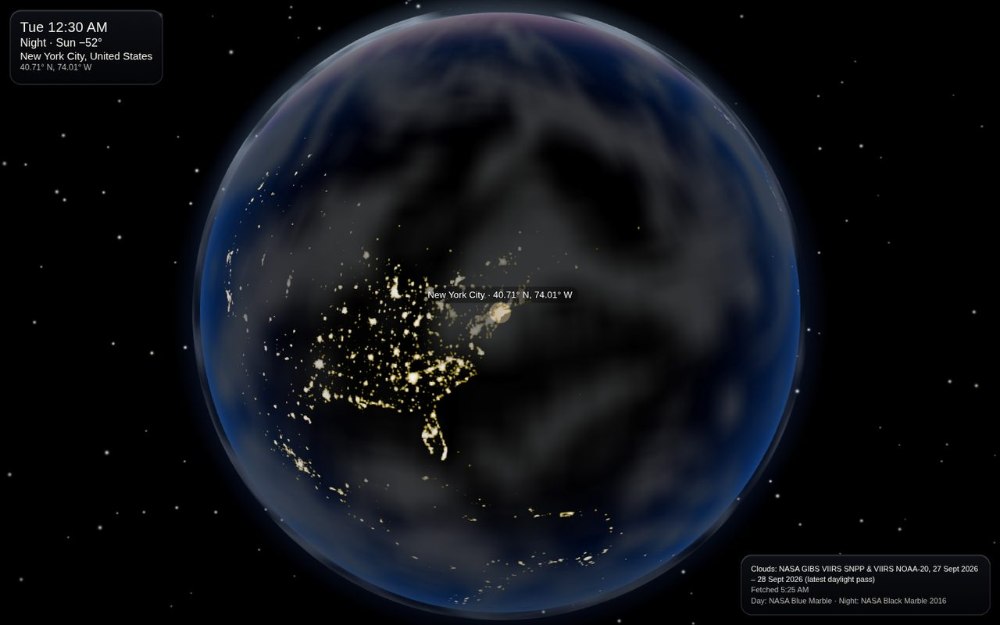

# Orbit View

Your place, from orbit. A full Earth hangs in a starfield, then the view flies down to wherever you are — still high enough to see the curve of the planet — with the real day-night line and recent cloud cover.

[Open it](https://aditano.github.io/orbit-view/)



Start asks the browser for your location. If that is declined, the view uses an approximate fix from your network address, or you can tap the globe and choose a spot. The camera eases in to about 4,200 km and keeps a glowing pin on that point.





The pictures above were taken with the clock held at 29 September 2026, 04:30 UTC, so Tokyo is in daylight and New York is at night.

## What you see

- A slowly rotating Earth, a black starfield, and a thin atmosphere.
- A glossy Start button in the spirit of the original iPhone.
- The real subsolar point for the current UTC time, using the Jean Meeus formulas from the [NOAA Solar Calculator](https://gml.noaa.gov/grad/solcalc/). Day imagery blends into night city lights across a soft twilight band, and the lighting keeps updating.
- Recent global clouds from the latest daylight satellite pass, drawn a little above the surface so they cast a soft shadow.
- A specular glint on the oceans, and a small moon lit by the same sun.
- Local time, whether it is day, twilight, or night, the sun’s elevation, when the clouds were fetched, and the imagery credits.

Drag to look around. Scroll or pinch to move between 1,500 km and 5,000 km. Recenter returns to the first fix.

## Run it locally

```bash
npm install
npm test
npm run dev
```

The dev server is at http://127.0.0.1:5173/orbit-view/. `npm run build` writes the GitHub Pages site to `dist/`.

## Imagery and location

Everything is fetched in the browser. There is no API key.

| Layer | Source |
| --- | --- |
| Day | [NASA GIBS](https://nasa-gibs.github.io/gibs-api-docs/) `BlueMarble_ShadedRelief_Bathymetry` (500 m, 1 August 2004) |
| Night | NASA GIBS `VIIRS_Black_Marble` (500 m, 2016) |
| Ocean mask | NASA GIBS `MODIS_Water_Mask` |
| Clouds | NASA GIBS `VIIRS_SNPP_CorrectedReflectance_TrueColor` and `VIIRS_NOAA20_CorrectedReflectance_TrueColor` (250 m JPEG). The app walks back up to six days and keeps the newest passes that actually contain data. |

GIBS is a public WMTS endpoint (`https://gibs.earthdata.nasa.gov/wmts/epsg4326/best/...`) and sends `Access-Control-Allow-Origin: *`, so the tiles load directly in the page. Clouds are the latest **daylight** VIIRS pass, not a thermal night product. If those tiles fail, the globe falls back to a static NASA Blue Marble cloud map and the corner note says so.

The static map is the public-domain [NASA Visible Earth cloud composite](https://eoimages.gsfc.nasa.gov/images/imagerecords/57000/57747/cloud_combined_2048.jpg).

Location, when the browser will not share it, comes from [geojs](https://www.geojs.io/) (`https://get.geojs.io/v1/ip/geo.json`). Place names come from [BigDataCloud](https://www.bigdatacloud.com/)’s client reverse-geocode endpoint, and the time zone from [timeapi.io](https://timeapi.io/).

Blue Marble, Black Marble, and the GIBS layers are NASA imagery. three.js draws the globe.

## Pages

Pushes to `main` build and deploy with GitHub Actions (`.github/workflows/pages.yml`). In the repository’s Pages settings, the source has to be GitHub Actions. The build already passes; the deploy publishes once that source is selected.
